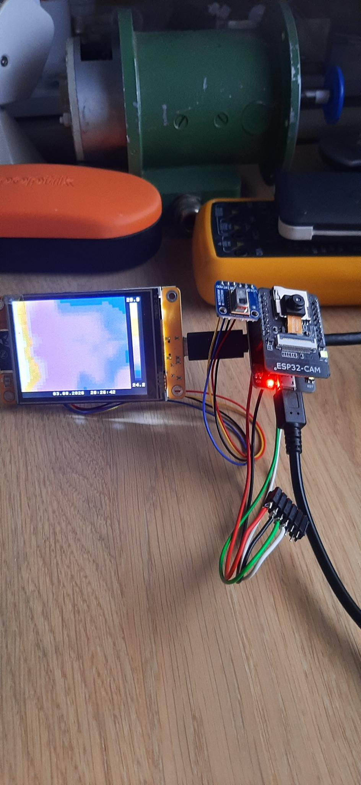

# Wärmebild-Fusion: ESP32-CAM und AMG8833 übereinandergelegt

Prof. Dr.-Ing. Ralph Wystup M.Sc. — erstellt mit KI und Agent (Claude Code, Anthropic)

**Seite öffnen:** https://ralphwystup.github.io/Waermebild-Fusion-mit-ESP32-CAM-und-AMG8833/ — der ganze Versuch im Browser an einer gezeichneten Szene: aus Tasse, Glas und Wand entsteht die
8×8-Matrix, wie der Sensor sie sieht; das Display-Board rechnet sie mit dem Code des Geräts zu 35 × 28 Kacheln in der
Eisenpalette; das Dashboard legt sie mit seinen Reglern über das Kamerabild. Dazu das Manuskript als Dokumentation in der
Seite. Läuft offline, ohne Gegenstelle.

Eine ESP32-CAM liefert ein MJPEG-Livebild. Ein AMG8833 (Grid-EYE, 8×8 Thermoelemente) hängt an einem eigenen ESP32 mit
Display, zeigt das Wärmebild dort an und gibt die 64 Temperaturen über HTTP als JSON heraus. Ein Browser-Dashboard legt
beides übereinander — verschiebbar, skalierbar, spiegelbar, teiltransparent — bis Wärmebild und Kamerabild deckungsgleich
sind; die gefundene Ausrichtung wird auf dem Display-Board gespeichert. Zwei Eigenheiten sind dabei zu beherrschen: der
Sensor sieht 60°, die Kamera 65°, und beide „Augen“ sitzen ein paar Zentimeter auseinander — die Parallaxe wandert mit der
Entfernung. Warum der Sensor nicht an der Kamera selbst hängt, steht in Abschnitt 10 des Manuskripts (GPIO14).

## Was drin ist

| Datei | Inhalt |
|:--|:--|
| [`Waermebild_1.0.html`](Waermebild_1.0.html) | die Seite: Szene, Sensormatrix, Display-Board, Dashboard mit Ausrichtung, Manuskript als Dokumentation |
| [`MANUSKRIPT_Thermo_Fusion.pdf`](MANUSKRIPT_Thermo_Fusion.pdf) | das Manuskript: Aufbau, Architektur, Sensor, alle drei Programme Zeile für Zeile, Ausrichtung, Inbetriebnahme, die Vorgeschichte mit GPIO14, Fehlersuche, Kapitel 14 zur Simulation in der Seite |
| `MANUSKRIPT_Thermo_Fusion.md`, `.docx` | dasselbe als Quelle (Markdown) und als Textverarbeitungsdatei |
| [`PRUEFPLAN_Seite.md`](PRUEFPLAN_Seite.md) | Prüfplan der Seite: 13 Kriterien mit Prüfmittel, Schranke und Ergebnis |
| `micropython/main.py` | **aktiv:** das Display-Board — Wärmebild auf dem ILI9341, Eisenpalette, geglättete Skala, Webserver `/thermo`, gespeicherte Ausrichtung |
| `micropython/main_waermebild_v1.py`, `_v2.py` | frühere Stände des Display-Programms (v1 feste Skala, v2 dynamische Skala mit NTP-Uhr) |
| `pc/thermo_cam_dashboard.py` | das Fusions-Dashboard für den PC: holt Stream und Thermodaten, überlagert beides, Regler für Position, Größe, Transparenz, Spiegelung |
| `firmware/ESP32_CAM_Stream.ino` | **aktiv:** die Netzwerkkamera (MJPEG über HTTP); Netzzugang eintragen |
| `firmware/ESP32_CAM_Thermo_Fusion.ino` | Archiv: die Variante mit Sensor an der Kamera (Modbus TCP) — siehe Abschnitt 10 |
| `firmware/ESP32_CAM_I2C_Test.ino`, `ESP32_CAM_Pin_Loopback.ino` | die beiden Diagnose-Sketche aus der Fehlersuche |
| `seite/` | Erzeuger der Seite, Browser-Prüfung, die Python-Nachrechnung des Displays (`referenz_anzeige.py`), das Prüfergebnis |
| `bilder/` | Fotos des Aufbaus |
| `index.html` | leitet auf die Seite weiter, damit GitHub Pages sie unter der Adresse oben zeigt |

Alle Netzadressen, Netznamen und Kennwörter des Aufbaus sind in dieser Veröffentlichung ersetzt: der Netzname durch
`<WLAN-Name>`, die Adressen durch `<IP-der-Kamera>` und `<IP-des-Display-Boards>`, jedes Kennwort durch genauso viele `x`,
wie es Zeichen hat — die Länge bleibt erkennbar, der Wert nicht. Wer den Versuch nachbaut, trägt seine eigenen Werte ein.

## Lizenz

MIT, siehe [LICENSE](LICENSE).
